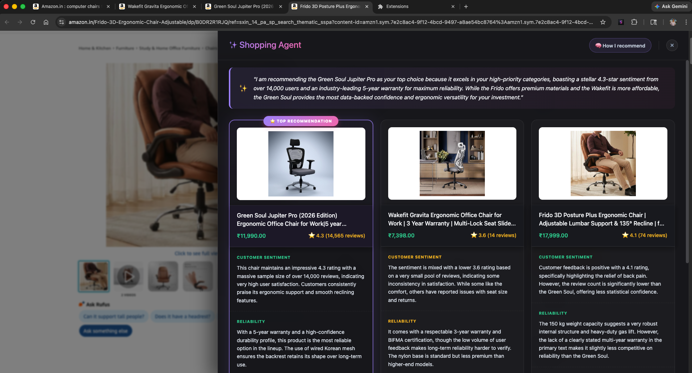

# Product Experience: Shopping Agent

This document breaks down the core visual identity and user interface of the Shopping Agent, illustrating how your "Decision Logic" is transformed into a functional AI matrix.

## 🖼️ The Central Dashboard

The Shopping Agent operates as a high-fidelity glassmorphism overlay on top of your shopping browser.

### 1. The Decision Narrative
At the top of the interface, the agent provides a **Natural Language Summary**. Instead of just showing numbers, it explains *why* a specific product is being recommended as the top choice.
> *Example: "I am recommending the Green Soul Jupiter Pro as your top choice because it excels in your high-priority categories..."*

### 2. The Recommendation Badge
The top-performing product is automatically highlighted with a **"⭐ TOP RECOMMENDATION"** banner, making it instantly clear which tab deserves your final click.

### 3. The Sentiment Matrix
Each product column is broken down by the criteria *you* defined (e.g., Customer Sentiment, Reliability, Aesthetics).
- **🟢 Positive Sentiment:** Highlighted in emerald green, indicating high confidence and positive user feedback.
- **🔴 Negative/Mixed Sentiment:** Highlighted in ruby red, flagging potential issues or lower user ratings.

### 4. Interactive Product Zones
Each product card acts as a single large click-zone. Clicking any part of the image, title, or price instantly jumps your browser back to that specific tab, making the "comparison-to-purchase" flow frictionless.

---

*Transforming scattered browser tabs into a single, intelligent decision engine.*
